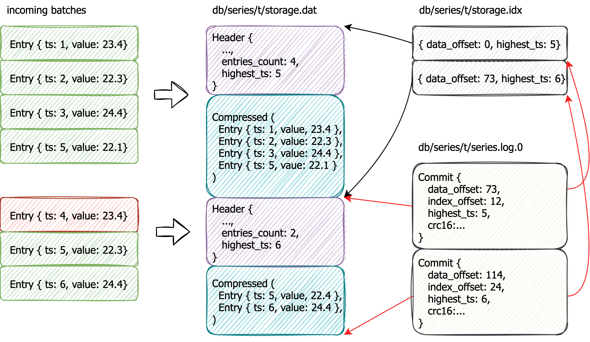

[](https://github.com/whiter4bbit/milliseriesdb/actions/workflows/release.yml)

# milliseriesdb

Oversimplified time-series database. I use it to collect and query the temperature and co2 metrics sent by [co2-monitor](https://github.com/whiter4bbit/co2-monitor).

**I only tested this in my personal environment and can not claim that will work well for the other use-cases / environments.**

## Table of Contents

- [Overview](#overview)
- [Getting Started](#getting-started)
- [API](#api)
  - [Create Series](#create-series)
  - [Append Entries](#append-entries)
  - [Query](#query)
  - [Export](#export)
  - [Restore](#restore)
- [Storage](#storage)
  - [Directory structure](#directory-structure)
    - [Data file](#data-file)
    - [Index file](#index-file) 
    - [Commit log](#commit-log)

## Overview

Data is collected in batches and stored in corresponding `series`:

```bash
cat <<EOF | http POST ":8080/series/t"
{
 "entries": [
     {
         "ts": 1621890712512,
         "value": 23.0
     },
     {
         "ts": 1621890714512,
         "value": 24.0
     },
     {
         "ts": 1621890715512,
         "value": 26.0
     }
 ]
}
EOF
```

Upon receiving the batch is sorted by timestamp in non-decreasing order and all entries that are lower than the last entry in the series are filtered out. That is, milliseriesdb assumes that the data send in non-decreasing order.

Query pattern:

```
http ":8080/series/t" from==2019-08-01 group_by==hour aggregators==mean\,min\,max limit==1000
```

Result: 

```json
{
  "rows": [
    {
      "timestamp": "2019-08-18T20:00:00+00:00",
      "values": [
        {
          "Mean": 22.962649253731286
        },
        {
          "Min": 22.85
        },
        {
          "Max": 23.1
        }
      ]
    },
    {
      "timestamp": "2019-08-18T21:00:00+00:00",
      "values": [
        {
          "Mean": 22.757492625368506
        },
        {
          "Min": 22.66
        },
        {
          "Max": 22.91
        }
      ]
    }
  ]
}
```

## Getting Started

Build manually:

```bash
cargo build --relase
```

Run:

```bash
target/release/milliseriesdb -p path/ server -a "0.0.0.0:8080"
```

Use docker container:
```bash
docker run -p 8080:8080 -v $(pwd)/path:/path whiter4bbit/milliseriesdb:latest -p /path server -a '0.0.0.0:8080'
```

## API

### Create series

```bash
PUT http://localhost:8080/series/t
```

### Append entries

```bash
cat <<EOF | http POST ':8080/series/t'
{
 "entries": [
     {
         "ts": 1621890712512,
         "value": 23.0
     },
     {
         "ts": 1621890714512,
         "value": 24.0
     },
     {
         "ts": 1621890715512,
         "value": 26.0
     }
 ]
}
EOF
```

* `ts` is timestamp, i64
* `value` is f64

Returns `404` if series doesn't exist

### Query

```bash
http ':8080/series/t' from==2019-08-01 group_by==hour aggregators==mean\,min\,max limit==1000
```

* `group_by` `hour`, `minute` or `day`
* `aggregators` `mean,min,max`

Returns `404` if series doesn't exist

### Export

Export series in csv format (`i64; f32`)

```bash
http ':8080/series/t/export' | gzip > t.csv.gz
```

Returns `404` is series doesn't exist

### Restore

Restore series from CSV format (`i64; f32`)

```bash
gzcat t.csv.gz | http ':8080/series/t/restore'
```

Returns `409` if series already exists

## Storage



Each series is stored in separate directory `{db_path}/{series_name}`. The incoming batch of entries is compressed and appended to the data file (as `block`) `series.dat`. For each block index entry is created (`highest ts of the block -> block offset`). The index is stored in `series. idx` and mmaped. 

Commit log is used to maintain consistency. Each entry from the commit log represents:
* `data_offset: u32` - offset points to the end of the last appended block in `series.dat`. The next block is written at this offset
* `index_offset: u32` - offset points to the end of last appended index entry in `series.idx`. The next index entry is written at this offset
* `highest_ts: i64` - highest timestamp of the series. Used to filter out incoming entries
* `crc16: u16`

After data and index files are updated and fsynced, the new commit log entry is created. Commit log is rotated (every 2Mb).

When the data is queried, the last (valid) commit log entry is read. Only index entries before `commit.index_offset` and data blocks before `commit.data_offset` are considered. 

A binary search by index file is used to find the starting block.

### Directory structure

 * `/{series_name}/series.dat`
 * `/{series_name}/series.idx`
 * `/{series_name}/series.log.{0,1,2,3...}`

Numbers (u32, u16, u8, etc..) are encoded in `bigendian`.

#### Data file
 
Data file stores sequential blocks of compressed entries.

```
+--------------------+------------------+-------------------+------------+
| entries_count: u32 | compression: u8  | payload_size: u32 | crc16: u16 | -> header
+--------------------+------------------+-------------------+------------+
| compressed_payload: u8[payload_size]                                   |
+------------------------------------------------------------------------+
```

`crc16` sum is computed for `(entries_count, compression, payload_size)` triple.

Currently self-implemented [delta compression](src/storage/compression.rs) is used.

Decoded payload has the following format:
```
+----------------+------------+  \
| ts: i64        | value: f64 |   |
+----------------+------------+   |
| ts: i64        | value: f64 |   | 
+----------------+------------+    \  
| ts: i64        | value: f64 |     | entries_count
+----------------+------------+    /
...                               |
+----------------+------------+   |
| ts: i64        | value: f64 |   | 
+----------------+------------+  /
```

Entries within the block are stored in non-decreasing order by timestamp. The ordering between blocks is maintained non-decreasing as well, so the last entry of the block `i` is not bigger than the first entry of the block `i + 1`.

#### Index file

Index file stores entry as pair `(highest_ts, block_start_offset)` for each block:

```
+-------------------+---------------+
| highest_ts: i64   | offset: u32   |
+-------------------+---------------+
| highest_ts: i64   | offset: u32   |
+-------------------+---------------+
...
+-------------------+---------------+
| highest_ts: i64   | offset: u32   |
+-------------------+---------------+
```

Entries within the index are stored in non-decreasing order by timestamp.

#### Commit Log

Commit log contains entries of the following format:

```
+-------------------+-------------------+-----------------+------------+
| data_offset: u32  | index_offset: u32 | highest_ts: i64 | crc16: u16 |
+-------------------+-------------------+-----------------+------------+
...
```

Each entry corresponds to the committed offset of the data file, index_file, and highest timestamp of the last block in a data file.
